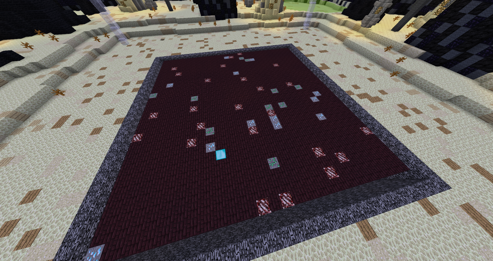

 

  

  <h3 align="center">Personal Mines Module</h3>

  

    A Personal mines module created for Vortex Network Prisons
     
    <a href="https://github.com/tyhh00/Personal-Mines"><strong>Explore the docs »</strong></a>
     
  

## About The Project

</bold>Project Accomplishments</bold>

* <a href="#readme-blockplacementalgorithm">Massive Block Placement Algorithm</a>
* Grid Creation and Manipulation Algorithm

(<a href="#readme-top">back to top</a>)

## Dependencies
* Modules Framework by <a href="https://github.com/despawningbone">despawningbone</a> (Currently Unreleased)

(<a href="#readme-top">back to top</a>)

## Features
* Mine Expansions
* Mine Factories
* Custom Mine Schematics
* Autominer
* Members System
* Settings & Boosters

## Massive Block Placement Algorithm
A couple of techniques were used to solve the problem of placing over 1,000,000 Blocks per private mine
* PMine Creation Queue system (Max mines generated/s depending on TPS)
* Schematics to FAWE Fast Print Mode

    
FAWE Fast Print Mode

    <code>
FaweQueue queue = FaweAPI.createQueue(
FaweAPI.getWorld(world.getBlockAt(mineCenterX, 128, mineCenterZ).getWorld().getName()), false);
queue.getRelighter().clear();
int count = 0;
for (int x = getMineCenterX() - getXZRadius(); x <= getMineCenterX() + getXZRadius(); x++) {
  for (int y = getMineYSurface(); y >= getMineYSurface() - getMineYLength() && y > 0; y--) {
    for (int z = mineCenterZ - getXZRadius(); z <= mineCenterZ + getXZRadius(); z++) {
      if(count < genTableBlockIDs.size())
      {
        MineBlock block = genTableBlockIDs.get(count++);
        if(block == null)
          queue.setBlock(x, y,z, Material.STONE.getId());
        else
          queue.setBlock(x, y, z, block.getMaterial().getId(), block.getData());  
      }
      else
        queue.setBlock(x, y, z, 0);   
    }
  }
}</code>

